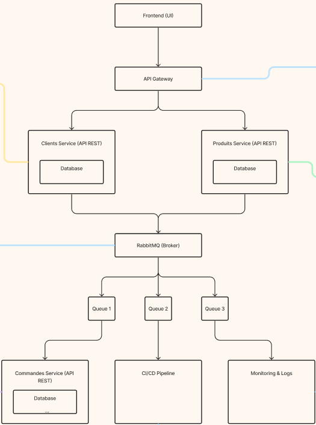

# PayeTonKawa

PayeTonKawa est une solution basée sur une architecture de microservices pour la gestion des clients, des produits et des commandes. Ce projet utilise Node.js et Express pour créer des APIs RESTful pour chaque service.

## Table des Matières

- [Architecture](#architecture)
- [Installation](#installation)
- [Utilisation](#utilisation)
- [Contributions](#contributions)

## Architecture



### Description des Services

- **Clients Service** : Gère les informations des clients.
  - Endpoints :
    - `GET /customers` : Récupère la liste des clients.
    - `GET /customers/:id` : Récupère un client via son ID.
    - `POST /customers` : Crée un nouveau client.
    - `PUT /customers/:id` : Met à jour un client.
    - `DELETE /customers/:id` : Supprime une fiche client.

- **Products Service** : Gère les informations des produits.
  - Endpoints :
    - `GET /products` : Récupère la liste des produits.
    - `GET /products/:id` : Récupère un produit via son ID.
    - `POST /products` : Crée un nouveau produit.
    - `PUT /products/:id` : Met à jour un produit.
    - `DELETE /products/:id` : Supprime une fiche produit.

- **Orders Service** : Gère les informations des commandes.
  - Endpoints :
    - `GET /orders` : Récupère la liste des commandes.
    - `GET /orders/:id` : Récupère une commande via son ID.
    - `POST /orders` : Crée une nouvelle commande.
    - `PUT /orders/:id` : Met à jour une commande.
    - `DELETE /orders/:id` : Supprime une commande.

## Installation

### Prérequis

- Node.js (v14 ou supérieur)
- npm (v6 ou supérieur)

### Cloner le dépôt

```bash
git clone https://github.com/5hiroe/PayeTonKawa.git
cd PayeTonKawa
```

### Installation des Dépendances

Pour chaque service, vous devez installer les dépendances nécessaires :

#### Clients Service

```
cd clients-service
npm install
```

#### Products Service
```
cd products-service
npm install
```

#### Orders Service

```
cd orders-service
npm install
```

## Utilisation

### Démarrer les Services

Assurez-vous d'avoir configuré les fichiers `.env` pour chaque service avec les bons ports.

#### Clients Service

```
cd clients-service
npm start
```

#### Products Service

```
cd products-service
npm start
```

#### Orders Service

```
cd orders-service
npm start
```

### Accéder aux Endpoints

Vous pouvez utiliser un outil comme Postman pour tester les endpoints de chaque service.

## Contributions

Voici comment vous pouvez contribuer :

1. Fork le dépôt.
2. Créez votre branche de fonctionnalité (*baliseCode*git checkout -b feature/AmazingFeature*baliseCode*).
3. Commitez vos changements (*baliseCode*git commit -m 'Add some AmazingFeature'*baliseCode*).
4. Poussez votre branche (*baliseCode*git push origin feature/AmazingFeature*baliseCode*).
5. Ouvrez une Pull Request.
